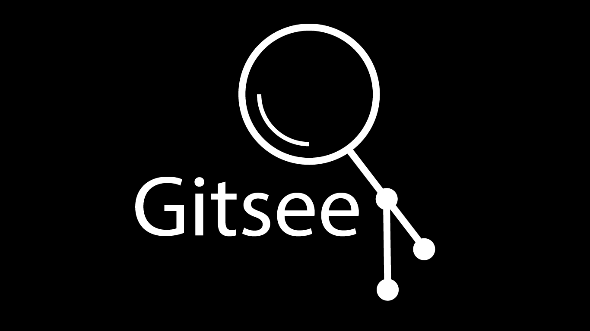
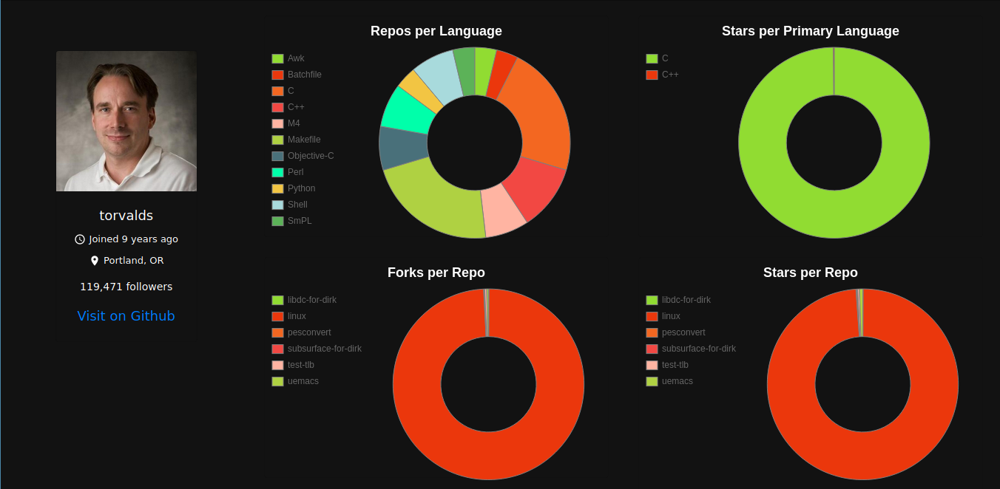

## git-see

#### Live on [https://g14a.github.io/gitsee/](https://g14a.github.io/gitsee/)




git-see is the backend service to visualize Github user and basic
repo information of him/her. This can be used as a part of hiring 
talent into your organization for getting a gist about the candidate.
It is built using [Go](golang.org), [React](https://reactjs.org/) along with [Github V4 API](https://developer.github.com/v4/).

#### Setup your local backend instance
1. Clone this repo.
2. Add a ```.env``` file to the project root directly and add a Github token in the
following  format:
    ```GHTOKEN=<your-token>```
3. Install [Go](golang.org) if you already haven't.
3. Run ```go mod tidy``` or ```go mod download```
4. Now ```go run main.go```

#### Setup local front end instance
1. In another terminal window, clone [github.com/g14a/fe-gitsee](github.com/g14a/fe-gitsee) repo.
2. Install ```node``` if you already haven't.
3. Run ```npm install``` inside the root directory.
4. Once you've done that, run ```npm start``` in the root directory.
5. Head to [localhost:3000](localhost:3000) and check it out.

#### Docker
1. Run ```docker-compose up``` after cloning this repo. Make sure
you add an ```.env``` file and append the Github token in the mentioned
format above.
2. Once the containers are fired, head to [localhost:80](localhost:80)
and voila!!
